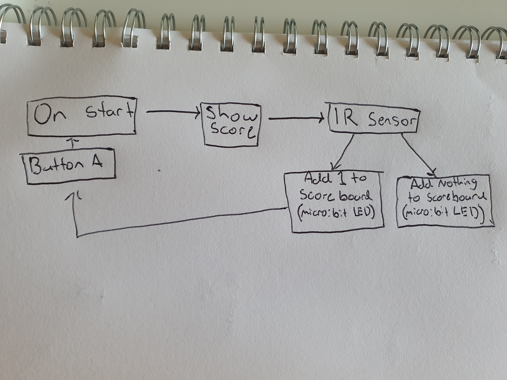

# 1701QCA Making Interaction - Assessment 2 workbook

You will use this workbook to keep track of your progress through the course and also as a process journal to document the making of your projects. The comments in italics throughout the template give suggestions about what to include. Feel free to delete those instructions when you have completed the sections.

When you have completed the template, submit the link to the GitHub Pages site for this repository as a link in Learning@Griffith. The link should be something like [https://qcainteractivemedia.github.io/1701QCA-Assessment2/](https://qcainteractivemedia.github.io/1701QCA-Assessment2/) where `qcainteractivemedia` is replaced with your GitHub username and `1701QCA-Assessment2` is replaced with whatever you called the repository this template is contained in when you set it up.

## Project working title ##
Mini Hoop Automatic Score Board

## Related projects ##

### Related project 1 ###
Automatic Arduino Goal Counter for Table Football/Soccer

https://www.youtube.com/watch?v=WqkIgd9vjbk

This project is related to mine because it has the same function and concept. They both are used to automatically count a score when playing a game.

### Related project 2 ###
Automatic Basketball Score Board

https://www.sitepoint.com/create-an-automated-scoreboard-that-senses-your-score-with-a-raspberry-pi/

This project is related to mine because it has the same function, concept and technology. They both are used to automatically count a score when playing a game. They also both are using a sensor to detect the ball going through the hoop. 

### Related project 3 ###
Automated Cornhole Scoring System

https://www.youtube.com/watch?v=AZAraY28n6E

This project is related to mine because it has the same function and concept. They both are used to automatically count a score when playing a game.  

### Related project 4 ###
Smart Basketball Scoreboard

https://create.arduino.cc/projecthub/marceloavilaoliveira/smart-basketball-scoreboard-f922cb

This project is related to mine because it has the same function, concept and technology. They both are used to automatically count a score when playing a game. They also both are using a sensor to detect the ball going through the hoop. This one is more advanced than mine because they are using a smart phone to display the score.

### Related project 5 ###
Touchless Automatic Motion Sensor Trash Can

https://www.hackster.io/will-su/touchless-automatic-motion-sensor-trash-can-bbeed1

This project is related to mine because it has the same Technology. They both use motion sensors to detect movement.

### Related project 6 ###
Security System

https://www.hackster.io/alpha/security-system-2188de

This project is related to mine because it has the same Technology. They both use motion sensors to detect movement.

## Other research ##

### *Brief resource name/description* ###
https://www.safewise.com/resources/motion-sensor-guide/
I first looked a motion sensors but figured it would be too difficult.

https://www.elprocus.com/infrared-ir-sensor-circuit-and-working/
This was a reading about how IR sensors work. It gave me a better understanding of how to use them. It is relevant to my project beacuse I am using an IR sensor.

## Conceptual progress ##

### Design intent ###
A game were it automatically counts the score when you make a shot.

### Design concept 1 ###
Basketball Bounce Tracker

The purpose of this this counter is to count the amount of times the ball is bounced. This will be done by using a micro:bit which will be attached to the ball and each time the ball hits the ground the mirco:bit will detect impact and add a number to the LED display.  

### Design concept 2 ###
Interactive Noughts and Crosses

This will be played like normal but will be more modern. Instead of drawing a nought or a cross you either single or double click a button (single click noughts, double tap crosses). When placed an X or O will be displayed on the micro:bit led display. 

### Final design concept ###
*This more fully developed concept should include consideration of the interaction scheme, technical functionality, fabrication approach, materials to be used, and aesthetic.*

Mini Basketball Automatic Score Board

This project will be a game were the aim is to score as money points as possible in under 30 seconds. How this will work is there will be a sensor right under the rim. I am still experimenting one which type of sensors I will use. The two main ones I'm testing is a light sensor and IR sensor. What I am thinking for the 30 second timer is when it runs out, the score will go back to 0 and it will make a noise. If I do chose to use a IR sensor I will have to purchase that and a micro:mate (breakout board). For the hoop itself I am going to construct one out of wood. The experience of the user will connect with the functionally of the project via vison and sound.

### Interaction flowchart ###

## Physical experimentation documentation ##

*You will probably have a range of images and screenshots. Any test videos should be uploaded to YouTube or other publicly accessible site and a link provided here.*

This is the code for the score board. I am unable to test it yet because I do not have the IR sensor micro:mate

This is the code for the timer. I have tested it and it's working. I just figure out a way to incorporate with the score board code.

https://youtu.be/TczXaRjO0-s

This is my design so far for the hoop. The micro: bit will be in the centre were it is easily to see the score. The IR sensor will be located right under the hoop so it senses the ball when it goes in. 

## Design process discussion ##

I first started my process thinking about my interests. I thought of basketball so I went with that. I then had to figure out how to incorporate an interactive idea to basketball. The first thing that came to my head was those games at the arcade were you have a certain amount of time to make as many shots as possible. I decided to use this as inspiration. I then had to figure out how they work, so then I went on google to find similar projects that use automatic scoring system. Most of them used some sort of sensor to detect the ball going through. So I further researched and found the best sensor to use for my project is a IR sensor. This is because it is very good a picking up motion. I then developed code so it will work with the IR sensor but I have do not got all the hardware to begin testing yet.

## Next steps ##

My plan moving forward is to collect all the hardware/ materials I will need to begin constructing, developing and testing my project. 
